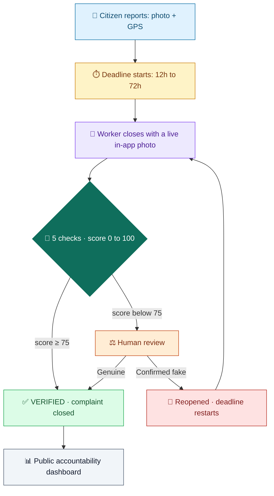
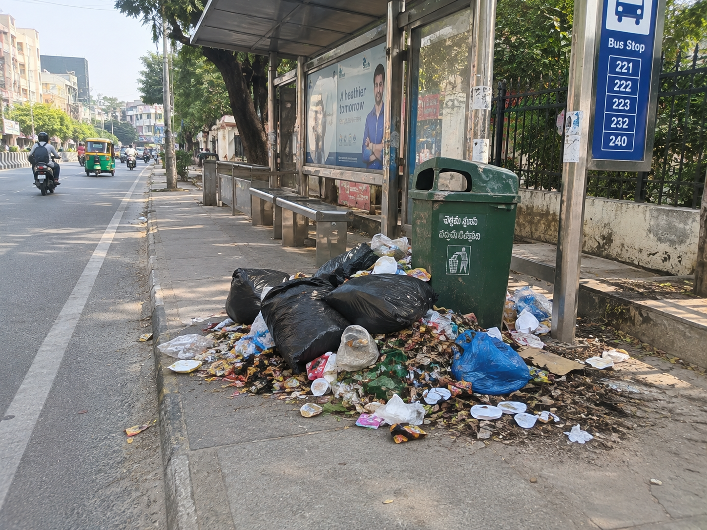
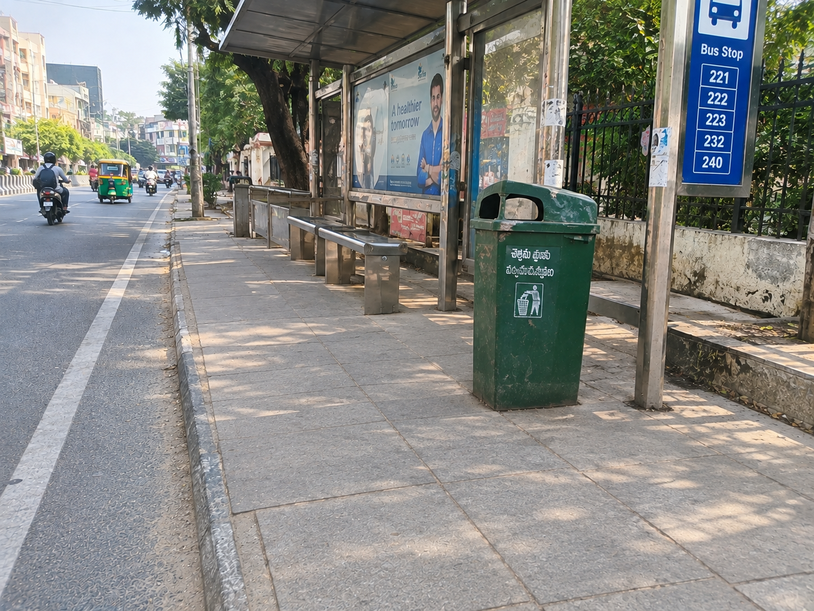
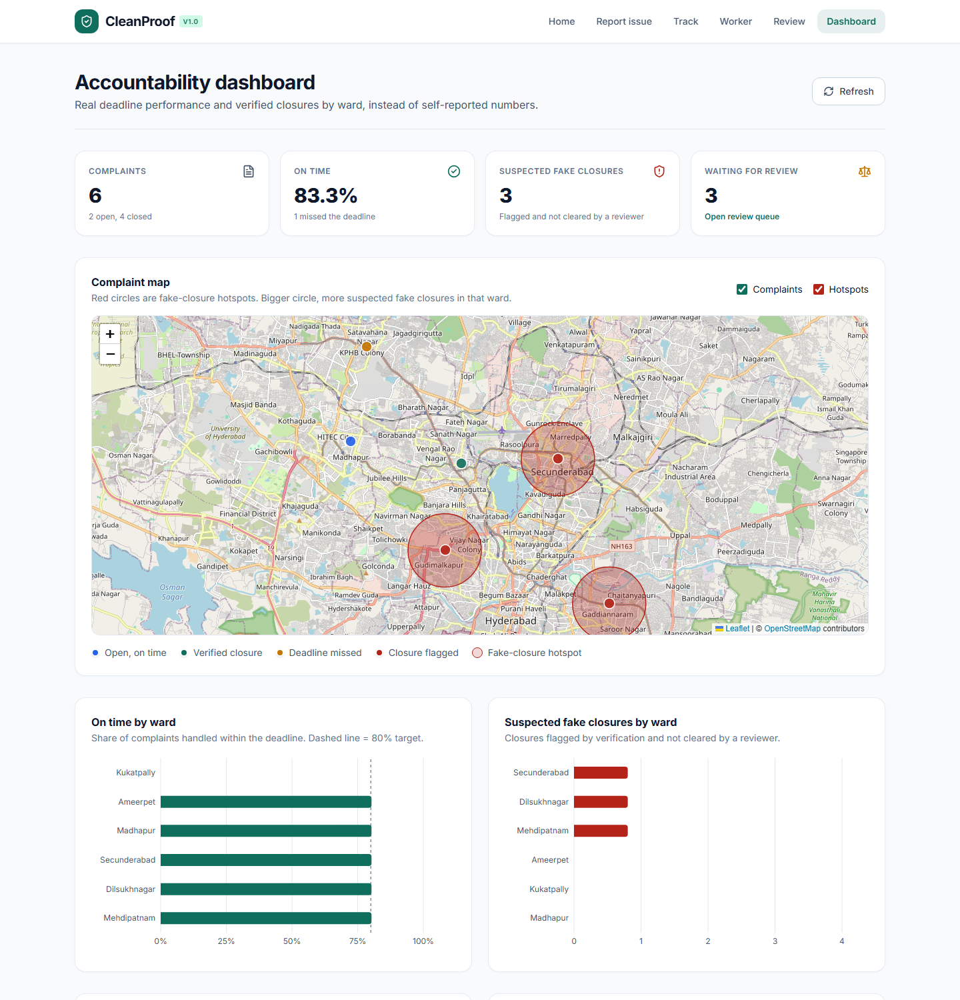
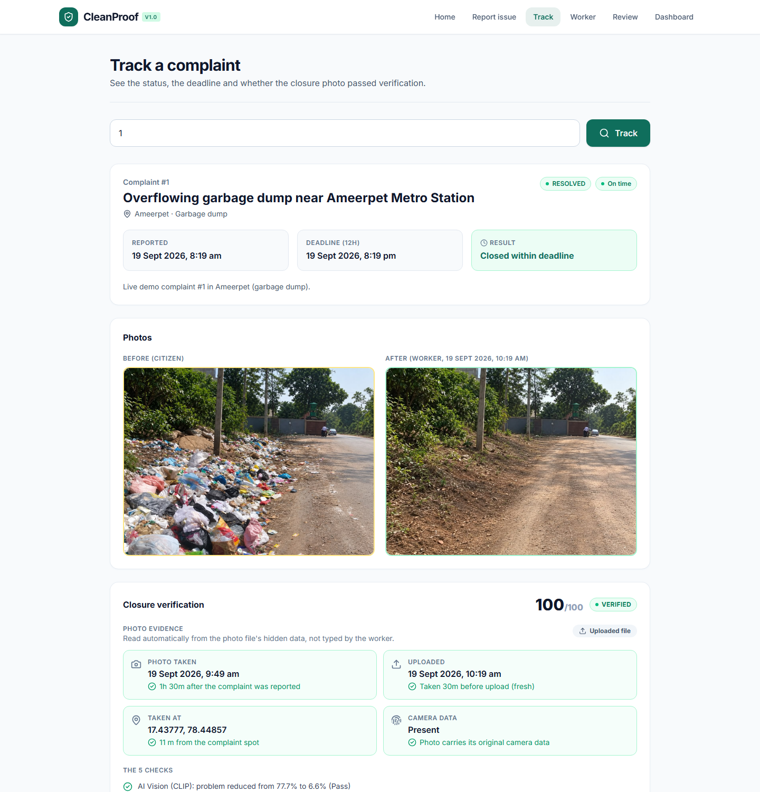
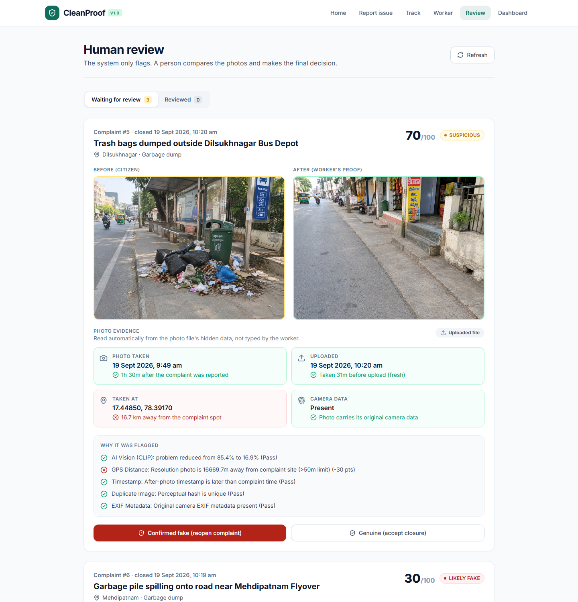
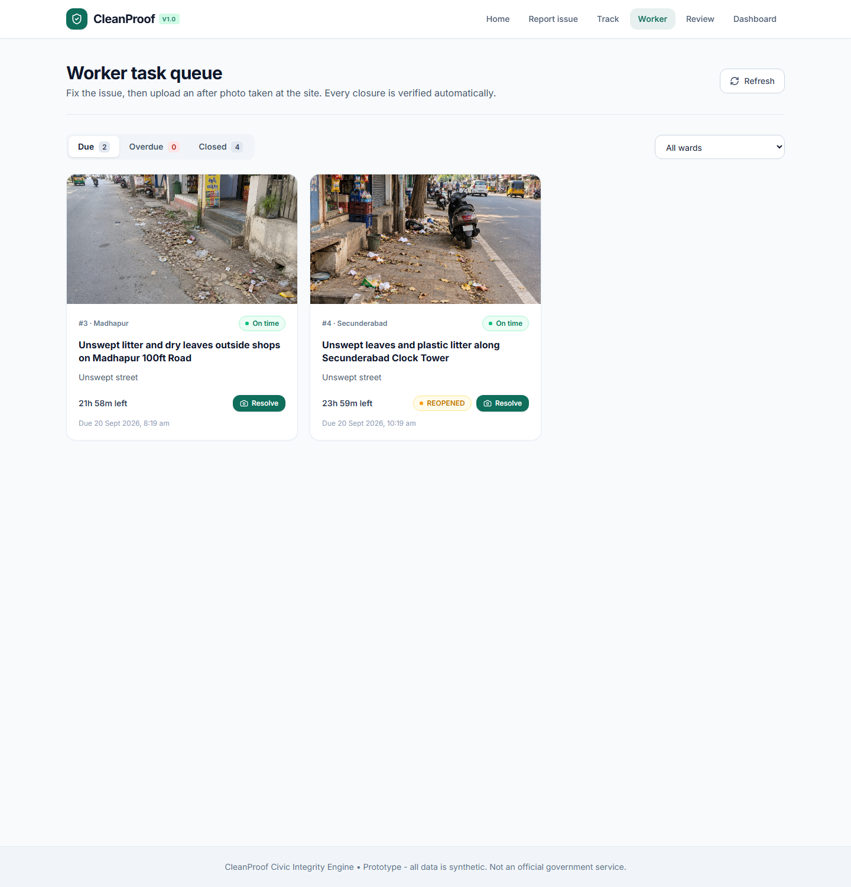

<div align="center">

# 🧹 CleanProof

## *Resolved? Prove it.*

### AI-Powered Verification of Civic Complaint Closures

**A complaint marked "resolved" is a claim, not proof.**

CleanProof checks every closure photo before it is accepted: is the garbage really gone,<br>
was the photo taken **here**, **now**, and is it **real**?

<br>


-8A2BE2?style=for-the-badge&logo=openai&logoColor=white)


<br>

[](https://25215a6610-cleanproof.static.hf.space)

<br>

[**Live dashboard**](https://25215a6610-cleanproof.static.hf.space) · [**The problem**](#-the-problem) · [**How it works**](#-how-it-works) · [**The 5 checks**](#-the-5-checks) · [**Features**](#-features) · [**Results**](#-results) · [**Run it**](#-run-it)

</div>

---

## 🚨 The problem

Civic complaint apps let workers close a complaint by marking it **"resolved"**, with nobody checking.
Garbage stays on the street, deadlines slip silently, and in 2026 municipal staff in Gurugram were
dismissed for closing complaints with **AI-faked before/after photos and spoofed GPS**.

> The reporting channel works. **The accountability loop does not.**

---

## 🔁 How it works

<div align="center">

| 1️⃣ Report | 2️⃣ Deadline | 3️⃣ Close | 4️⃣ Verify | 5️⃣ Review | 6️⃣ Track |
|:-:|:-:|:-:|:-:|:-:|:-:|
| 📸 | ⏱️ | 🧹 | 🤖 | ⚖️ | 📊 |
| Citizen reports<br>with photo + GPS | Official SLA clock<br>12h to 72h | Worker closes with<br>live in-app photo | 5 checks give a<br>score from 0 to 100 | Flagged closures go<br>to a human reviewer | Every result lands on<br>the public dashboard |

</div>



<table>
<tr>
<td align="center"><b>Before</b> (citizen)</td>
<td align="center"><b>After</b> (worker)</td>
<td align="center"><b>Verdict</b></td>
</tr>
<tr>
<td></td>
<td></td>
<td align="center">Real photo from the site<br><b>✅ 100 · VERIFIED</b><br><br>Same dirty photo re-used<br><b>❌ 20 · LIKELY FAKE</b><br><br>AI-generated "clean" photo<br><b>❌ 30 · LIKELY FAKE</b></td>
</tr>
</table>

---

## 📸 Screenshots

<table>
<tr>
<td width="50%"><b>📊 Accountability dashboard</b><br><sub>Fake-closure hotspots, on-time % and delay reasons by ward</sub><br><br></td>
<td width="50%"><b>🧾 Verified closure</b><br><sub>Before/after photos, score and photo evidence for everyone</sub><br><br></td>
</tr>
<tr>
<td width="50%"><b>⚖️ Human review</b><br><sub>Flagged closures side by side, with the reasons</sub><br><br></td>
<td width="50%"><b>🧹 Worker task queue</b><br><sub>Due, overdue and closed complaints; resolve with a live photo</sub><br><br></td>
</tr>
</table>

---

## 🔍 The 5 checks

Every closure starts at **100 points**. Each failed check deducts points and adds a plain-English reason.

| | Check | Catches | Points |
|:-:|---|---|:-:|
| 🤖 | **AI vision (CLIP)**: is the problem reduced vs. the citizen's photo? | Garbage still there | **−50** |
| 📍 | **Location**: photo GPS within 50 m of the complaint | Photo taken elsewhere | **−30** |
| 🕒 | **Time**: photo taken after the complaint (or reopen) | Old photos | **−30** |
| 🔁 | **Duplicate**: perceptual fingerprint (pHash) | Same photo re-used | **−30** |
| 📷 | **Camera data**: real EXIF present | AI-generated or downloaded images | **−10** |

<div align="center">


**The AI only flags. A human always makes the final decision.**

</div>

---

## ✨ Features

| | |
|---|---|
| 📷 **Live in-app camera** | Workers cannot pick gallery photos. Server clock + device GPS, stamped onto the photo. |
| 🧾 **Photo evidence panel** | When and where the photo was taken, how fresh it was, distance from the site. Visible to everyone. |
| 🚫 **Smart photo gate** | Rejects selfies, screenshots and non-garbage photos; asks to retake blurry or dark closure photos. |
| ⏰ **Deadline accountability** | Official SLA per category. Late closures must state a reason. |
| ⚖️ **Human review** | Flagged closures compared side by side; *Confirmed fake* reopens the complaint. |
| 🔁 **Citizen reopen** | One photo reopens a fake closure and restarts the deadline. |
| 🗺️ **Accountability dashboard** | Map, fake-closure hotspots, on-time % by ward, delay reasons. |
| 📱 **Works on any phone** | HTTPS link with camera and GPS; citizens can also report later from the gallery (location read from the photo). |

---

## 📈 Results

| Test | Result |
|---|:-:|
| Demo before/after pairs (incl. re-used and AI-faked photos) | **12 / 13** |
| Hard photos: blurry, dark, low-resolution, partly cleaned | **83% → 95%** after our improvements |
| 200 real street photos (TACO dataset): re-used dirty photo caught | **100%** |
| 200 real street photos: litter found, even slightly blurry | **up to 100%** |
| Relevance gate: selfies and screenshots rejected, real litter accepted | **97%** accepted |

<sub>All demo data is synthetic, as the problem statement requires. TACO (CC BY 4.0) is used only to measure accuracy.</sub>

---

## 🛠️ Tech stack

<div align="center">

| Layer | Technology |
|:-:|:-:|
| 🎨 Frontend | React · Vite · Tailwind CSS · Leaflet · Recharts |
| ⚙️ Backend | FastAPI · SQLAlchemy · SQLite |
| 🤖 AI | CLIP `openai/clip-vit-base-patch32` via PyTorch, **runs locally, no API key** |
| 🔬 Forensics | Pillow · piexif · imagehash (pHash) · exifr |

</div>

---

## 🚀 Run it

```bash
# Windows: one click
START_DEMO.bat
```

```bash
# or manually
cd backend && python -m venv venv && venv\Scripts\pip install -r requirements.txt
venv\Scripts\python -m uvicorn app.main:app --port 8000
cd frontend && npm install && npm run dev        # https://localhost:5173
```

<details>
<summary><b>📁 Project structure</b></summary>

```text
backend/app/services/   verification.py · clip_service.py · image_quality.py · photo_stamp.py
backend/app/routers/    complaints · dashboard · verification (human review)
frontend/src/pages/     Report · Track · Worker · Review · Dashboard
scripts/                reset_demo · demo_dry_run · eval_clip · eval_robustness · eval_taco
data/demo/              synthetic before/after/fraud photos
```
</details>

---

## 🛡️ Responsible by design

- 🔒 **No personal data**: no names, phone numbers or accounts
- 🧑‍⚖️ **No automatic penalties**: every flag goes to a human
- 🧪 **Synthetic data only**, clearly labelled
- 🏛️ **Not an official government service**: our own name and branding

## 🔭 Next steps

YOLO item counting (*"14 items → 0"*) · dedicated AI-image detector · device attestation · PostgreSQL + PostGIS · regional languages

---

<div align="center">

**Built for TechSurge Hackathon · Kalachakra 2K26 · PS-D04 "Resolved, Allegedly"**

Made with 💚 at BVRIT Narsapur

</div>
